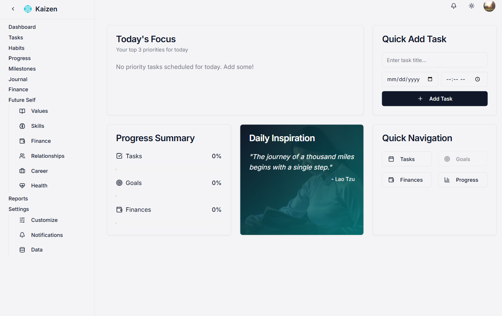

markdown

# Kaizen - Your Personal Development Journey

 
_A sample screenshot of the Kaizen app._

## Table of Contents

- [Overview](#overview)
- [Core Features](#core-features)
- [Technologies Used](#technologies-used)
- [Setup Instructions](#setup-instructions)
    - [Prerequisites](#prerequisites)
    - [Installation](#installation)
- [Folder Structure](#folder-structure)
- [Contributing](#contributing)
- [License](#license)


## Overview

Kaizen is a Next.js application designed to help you track and improve various aspects of your life, inspired by the Japanese philosophy of continuous improvement. It offers tools for task management, habit tracking, financial planning, journaling, and more, all in one place.

This project was developed by **Goldsmith Goula** ([goldsmithgoula@gmail.com](mailto:goldsmithgoula@gmail.com)).

- GitHub: [goldsmith-goula.github.io](https://goldsmith-goula.github.io)
- LinkedIn: [Goldsmith Goula](https://linkedin.com/in/tchouala-goula-ii-goldsmith-317a5035b)
- Project Name: Kaizen

## Core Features

-   **Dashboard:** Provides an overview of your day, displaying top priority tasks, a progress summary, and a motivational quote.

-   **Task Manager:** Organize your tasks with a calendar view, drag-and-drop interface, status tracking, and support for recurring tasks.

-   **Habit Tracker:** Build consistent habits with daily streak tracking and visual aids.

-   **Financial Dashboard:** Create budgets, log transactions, and visualize your financial goals.

-   **Progress Journal:** Record your thoughts and feelings with timestamps and mood tracking.

-   **Milestone Tracking:** Celebrate key achievements to stay motivated.

-   **Future Self Builder:** Define who you want to become across different life categories.

-   **Reporting:** Generate weekly and monthly progress reports to gain insights into your performance.

## Technologies Used

-   **Next.js:** A React framework for building performant web applications.
-   **TypeScript:** Adds static typing to JavaScript for improved code quality.
-   **Tailwind CSS:** A utility-first CSS framework for rapid UI development.
-   **ShadCN/UI:** Reusable UI components built with Radix UI and Tailwind CSS.
-   **Lucide React:** A library of beautiful, consistent icons.
-   **Firebase:** A comprehensive platform for building web and mobile applications, providing authentication, database, storage, and more.
-   **Genkit:** toolkit to call LLMs and image generation models.
-   **Date-fns:** Modern JavaScript date utility library.
-   **Recharts:** A composable charting library built on React components.
-   **Zod:** TypeScript-first schema declaration and validation.
-   **Framer Motion:** A production-ready motion library for React.
-   **React Hook Form**: For building performant, flexible and extensible forms with easy-to-use validation.
-   **TanStack Query**: Powerful asynchronous state management.

## Setup Instructions

Follow these steps to get the Kaizen project up and running on your local machine.

### Prerequisites

-   Node.js (version 18 or higher)
-   npm or yarn package manager

### Installation

1.  Clone the repository:

    ```bash
    git clone https://github.com/Goldsmith-Goula/Kaizen
    cd kaizen
    ```

2.  Install the dependencies:

    ```bash
    npm install
    # or
    yarn install
    ```


3.  Run the development server:

    ```bash
    npm run dev
    # or
    yarn dev
    ```

    Open your browser and navigate to `http://localhost:9002` to see the application running.

## Folder Structure

```
kaizen/
├── .env.local             # Environment variables (Firebase credentials)
├── next.config.js        # Next.js configuration
├── package.json          # Project dependencies and scripts
├── README.md             # Project documentation (this file)
├── src/
│   ├── ai/                  # Genkit AI code
│   ├── app/                 # Next.js app directory
│   │   ├── finance/         # Finance page components
│   │   ├── habits/          # Habit tracker page components
│   │   ├── journal/         # Journaling page components
│   │   ├── milestones/      # Milestone tracking page components
│   │   ├── page.tsx         # Dashboard page component
│   │   ├── layout.tsx       # Main layout component
│   │   └── ...              # Other page routes
│   ├── components/          # Reusable React components
│   │   ├── ui/              # Shadcn/UI components
│   │   └── ...              # Custom components
│   ├── context/           # React Context providers
│   ├── hooks/             # Custom React hooks
│   ├── lib/               # Utility functions and data schemas
│   └── styles/            # Global CSS styles

```
## Contributing

Contributions are welcome! Please follow these steps:

1.  Fork the repository.
2.  Create a new branch for your feature or bug fix.
3.  Make your changes and commit them with descriptive messages.
4.  Submit a pull request.

## License

This project is licensed under the [MIT License](./MIT.md).